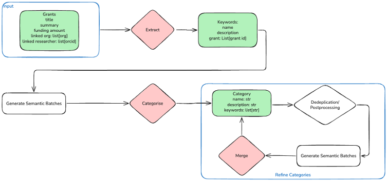

# AI-Powered Analysis of ORCID and RLA Data for Technology Landscaping

ORCID profiles provide a substantial amount of information about research communities. ORCID is considered a key data source for providing valuable and open-access data about researchers and their research works. However, ORCID also has potential to inform Technology Landscaping regarding researchers and their associated research networks, with potential applications including identifying technical expertise, emerging research communities, and investment opportunities. 

This presentation features a case study leveraging over 100,000 Australian ORCID researcher profiles and their research outcome collected from ARDC Research Link platform. We demonstrate how we have collected, connected, and analysed this dataset to observe the time-series evolution of the Australian research communities. The resulting animation will illustrate five years of historical developments within these communities. This will also establish a robust foundation for projecting future technological trends in Australia. 

Aligning with the technical aspect of this presentation, we demonstrate an AI pipeline using LLM model to analyse our data and achieve the visualisation results. This makes the solution presented in our work accessible and interoperable with many research infrastructure solutions in universities. We will discuss the technical challenges and opportunities observed while developing and deploying this solution in Nectar Cloud. We believe the lessons learned from our work can help identify potential new use cases for application of AI pipelines to analyse ORCID and other open scholarly data. 

# Methodology 

THe following figure shows the overall workflow. 

The input is a list of grants coming like 
